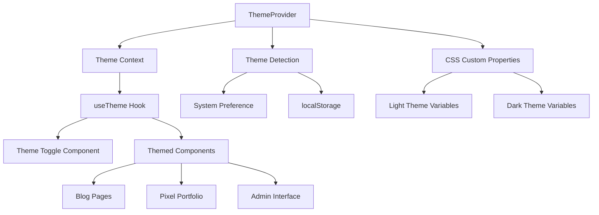

# Design Document: Dark Mode Theme System

## Overview

本设计文档详细说明了深色模式主题系统的技术实现方案。该系统基于 React Context、CSS 自定义属性和 localStorage 构建，为整个应用提供统一的主题管理能力。系统支持三种模式：浅色、深色和跟随系统，并确保在所有现有组件中提供一致的用户体验。

## Architecture

### 系统架构图



### 核心组件关系

1. **ThemeProvider**: 全局主题状态管理
2. **useTheme Hook**: 组件级主题访问接口
3. **ThemeToggle**: 用户界面切换组件
4. **CSS Variables**: 动态主题样式系统

## Components and Interfaces

### 1. Theme Provider 系统

#### ThemeProvider 组件
```typescript
interface ThemeContextValue {
  theme: 'light' | 'dark' | 'system';
  resolvedTheme: 'light' | 'dark';
  setTheme: (theme: 'light' | 'dark' | 'system') => void;
  systemTheme: 'light' | 'dark';
}

interface ThemeProviderProps {
  children: React.ReactNode;
  defaultTheme?: 'light' | 'dark' | 'system';
  storageKey?: string;
}
```

**核心功能**:
- 管理当前主题状态 (light/dark/system)
- 检测系统偏好变化
- 持久化用户选择到 localStorage
- 应用 CSS 自定义属性到 document.documentElement

#### useTheme Hook
```typescript
function useTheme(): ThemeContextValue {
  const context = useContext(ThemeContext);
  if (!context) {
    throw new Error('useTheme must be used within ThemeProvider');
  }
  return context;
}
```

### 2. 主题切换组件

#### ThemeToggle 组件
```typescript
interface ThemeToggleProps {
  variant?: 'icon' | 'dropdown' | 'segmented';
  size?: 'sm' | 'md' | 'lg';
  showLabel?: boolean;
  className?: string;
}
```

**设计特点**:
- 支持多种视觉样式 (图标、下拉菜单、分段控制)
- 键盘导航支持
- ARIA 标签和屏幕阅读器支持
- 平滑过渡动画

### 3. CSS 自定义属性系统

#### 颜色变量结构
```css
:root {
  /* Light Theme */
  --color-background: #ffffff;
  --color-background-secondary: #fafafa;
  --color-background-tertiary: #f5f5f5;
  
  --color-text-primary: #1a1a1a;
  --color-text-secondary: #666666;
  --color-text-muted: #999999;
  
  --color-border: #e0e0e0;
  --color-border-light: #f0f0f0;
  
  --color-accent: #0066cc;
  --color-accent-hover: #0052a3;
  
  /* Semantic Colors */
  --color-success: #10b981;
  --color-warning: #f59e0b;
  --color-error: #ef4444;
  --color-info: #3b82f6;
}

[data-theme="dark"] {
  /* Dark Theme */
  --color-background: #0a0a0a;
  --color-background-secondary: #1a1a1a;
  --color-background-tertiary: #2a2a2a;
  
  --color-text-primary: #ffffff;
  --color-text-secondary: #e5e5e5;
  --color-text-muted: #a0a0a0;
  
  --color-border: #333333;
  --color-border-light: #404040;
  
  --color-accent: #3b82f6;
  --color-accent-hover: #2563eb;
  
  /* Semantic Colors - Adjusted for dark mode */
  --color-success: #059669;
  --color-warning: #d97706;
  --color-error: #dc2626;
  --color-info: #2563eb;
}
```

## Data Models

### 主题配置接口

```typescript
interface ThemeConfig {
  colors: {
    light: ColorPalette;
    dark: ColorPalette;
  };
  transitions: {
    duration: string;
    easing: string;
  };
  storage: {
    key: string;
  };
}

interface ColorPalette {
  background: {
    primary: string;
    secondary: string;
    tertiary: string;
  };
  text: {
    primary: string;
    secondary: string;
    muted: string;
  };
  border: {
    default: string;
    light: string;
  };
  accent: {
    primary: string;
    hover: string;
  };
  semantic: {
    success: string;
    warning: string;
    error: string;
    info: string;
  };
}
```

## Correctness Properties

*A property is a characteristic or behavior that should hold true across all valid executions of a system-essentially, a formal statement about what the system should do. Properties serve as the bridge between human-readable specifications and machine-verifiable correctness guarantees.*

### Property 1: Theme State Consistency
*For any* theme provider instance, the resolved theme should always be either 'light' or 'dark', regardless of the selected theme mode (including 'system')
**Validates: Requirements 1.3, 1.6, 1.7**

### Property 2: Theme Persistence Reliability
*For any* valid theme selection ('light', 'dark', 'system'), storing and retrieving from localStorage should preserve the exact theme choice
**Validates: Requirements 8.1, 8.2, 8.5**

### Property 3: System Preference Detection
*For any* system theme preference change, when theme mode is 'system', the resolved theme should automatically update to match the system preference
**Validates: Requirements 1.4, 1.7**

### Property 4: Color Contrast Compliance
*For any* color combination in both light and dark themes, the contrast ratio should meet or exceed WCAG AA standards (4.5:1 for normal text, 3:1 for large text)
**Validates: Requirements 2.5, 10.4**

### Property 5: Theme Toggle Accessibility
*For any* theme toggle interaction (keyboard or mouse), the component should announce the theme change to screen readers and update ARIA attributes correctly
**Validates: Requirements 3.5, 10.1, 10.2**

### Property 6: CSS Variable Application
*For any* theme change, all CSS custom properties should be updated synchronously on the document root element before the next paint
**Validates: Requirements 1.5, 7.4, 11.2**

### Property 7: Theme Initialization Timing
*For any* page load, theme initialization should complete before first contentful paint to prevent theme flashing
**Validates: Requirements 7.4, 8.4, 11.3**

### Property 8: Cross-Tab Synchronization
*For any* theme change in one browser tab, all other tabs of the same origin should update to the same theme within 100ms
**Validates: Requirements 8.6**

### Property 9: Reduced Motion Compliance
*For any* user with `prefers-reduced-motion: reduce`, theme transitions should be disabled or reduced to respect accessibility preferences
**Validates: Requirements 7.5, 10.6**

### Property 10: Theme Component Isolation
*For any* component using the theme system, theme changes should not cause unnecessary re-renders of components that don't depend on theme values
**Validates: Requirements 11.5, 11.6**

## Error Handling

### 主题系统错误处理策略

1. **localStorage 错误**:
   - 捕获 localStorage 访问异常
   - 降级到内存存储
   - 记录错误但不中断用户体验

2. **系统偏好检测失败**:
   - 默认使用浅色主题
   - 提供手动切换选项
   - 定期重试检测

3. **CSS 自定义属性不支持**:
   - 检测浏览器支持
   - 降级到静态 CSS 类
   - 保持基本主题功能

4. **Context 未提供错误**:
   - 清晰的错误消息
   - 开发时警告
   - 生产环境降级处理

## Testing Strategy

### 单元测试策略

**组件测试**:
- ThemeProvider 状态管理
- useTheme hook 功能
- ThemeToggle 交互行为
- CSS 变量应用逻辑

**集成测试**:
- 完整主题切换流程
- localStorage 持久化
- 系统偏好检测
- 跨组件主题应用

### 属性测试策略

**使用 fast-check 库进行属性测试**:
- 每个属性测试最少 100 次迭代
- 测试随机主题状态组合
- 验证颜色对比度计算
- 测试边界条件和异常情况

**测试配置**:
```typescript
// 示例属性测试
describe('Theme System Properties', () => {
  it('Property 1: Theme State Consistency', () => {
    fc.assert(fc.property(
      fc.oneof(fc.constant('light'), fc.constant('dark'), fc.constant('system')),
      fc.oneof(fc.constant('light'), fc.constant('dark')), // system preference
      (themeMode, systemPreference) => {
        const resolvedTheme = resolveTheme(themeMode, systemPreference);
        return resolvedTheme === 'light' || resolvedTheme === 'dark';
      }
    ), { numRuns: 100 });
  });
});
```

### 可访问性测试

**自动化测试**:
- axe-core 集成测试
- 键盘导航测试
- 屏幕阅读器兼容性
- 颜色对比度验证

**手动测试**:
- 实际屏幕阅读器测试
- 键盘导航流程
- 高对比度模式测试
- 移动设备触摸测试

### 性能测试

**性能指标**:
- 主题切换延迟 < 50ms
- 初始化时间 < 10ms
- 内存使用稳定
- 无内存泄漏

**测试工具**:
- React DevTools Profiler
- Chrome DevTools Performance
- Lighthouse 性能审计
- Bundle 大小分析

## Implementation Notes

### 开发优先级

1. **Phase 1**: 核心主题系统 (ThemeProvider, useTheme, CSS 变量)
2. **Phase 2**: 主题切换组件和持久化
3. **Phase 3**: 现有组件深色模式适配
4. **Phase 4**: 动画和过渡效果
5. **Phase 5**: 可访问性和性能优化

### 技术考虑

**CSS-in-JS vs CSS 自定义属性**:
- 选择 CSS 自定义属性以获得更好的性能
- 避免运行时样式计算
- 支持 CSS 过渡动画

**服务端渲染 (SSR) 支持**:
- 防止主题闪烁 (FOUC)
- 服务端主题检测
- 客户端水合一致性

**浏览器兼容性**:
- CSS 自定义属性支持 (IE 11+)
- prefers-color-scheme 支持 (现代浏览器)
- localStorage 支持 (IE 8+)

### 扩展性设计

**主题扩展**:
- 支持自定义颜色方案
- 主题插件系统
- 动态主题加载

**组件适配模式**:
- 统一的主题 hook 使用
- 一致的 CSS 变量命名
- 可复用的主题工具函数