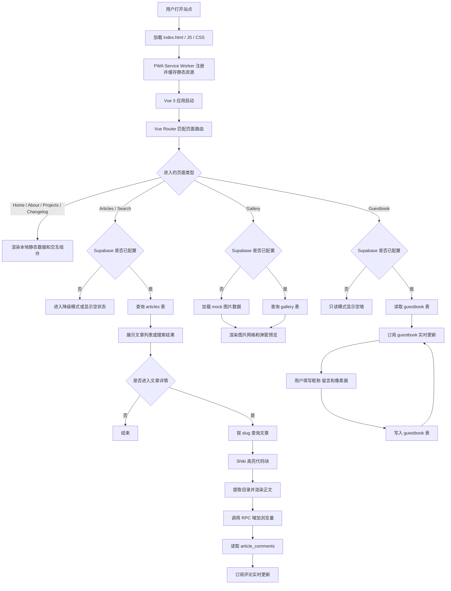
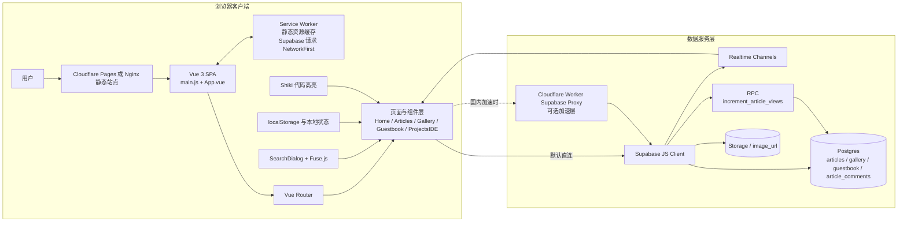

# 博客前端流程图与架构图

这份文档基于当前代码实现整理，主要参考：

- `src/main.js`
- `src/router/index.js`
- `src/lib/supabase.js`
- `src/views/ArticleDetail.vue`
- `src/views/Gallery.vue`
- `src/views/Guestbook.vue`
- `src/components/Comments.vue`
- `src/components/shared/SearchDialog.vue`
- `vite.config.js`
- `../scripts/supabase-proxy.js`

## 1. 流程图

## 2. 架构图

## 3. 图示说明

- 这是一个 `Vue 3 + Vite + Vue Router` 的单页应用，页面渲染发生在浏览器端。
- `Supabase` 同时承担数据库访问、实时订阅和部分 RPC 能力。
- `Guestbook` 与 `Comments` 都依赖 Realtime 订阅来实现新增内容自动刷新。
- `Gallery` 在未配置 Supabase 时会退回到 mock 数据，`Guestbook` 则进入只读降级模式。
- `Cloudflare Worker` 代理不是强制组件，只在国内访问 Supabase 较慢时作为可选加速层。
- `vite-plugin-pwa` 生成的 Service Worker 会缓存静态资源，并对 Supabase 请求采用 `NetworkFirst` 策略。
